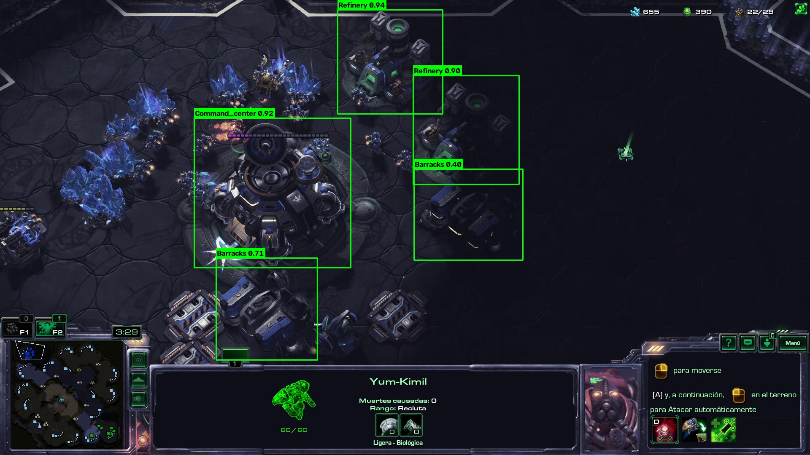

# SC2 Scouting — Detección de edificios Terran con YOLO26

Proyecto semestral de **Introducción a Visión por Computadora**. Se entrena un detector
**YOLO26** de edificios Terran de *StarCraft II* para automatizar el *scouting*: sobre cada
edificio detectado se entrega una **lectura estratégica** (qué produce, qué amenaza implica,
en qué minuto y cómo responder), tanto en imágenes como en video en tiempo real.

## Resultados del modelo

Entrenado desde `yolo26s.pt` (transfer learning), 114/150 épocas con *early stopping*.

| Métrica | Valor |
|---|---|
| mAP50 | **0.974** |
| mAP50-95 | 0.743 |
| Precision | 0.91 |
| Recall | 0.94 |

**7 clases:** `Armory`, `Barracks`, `Command_center`, `Engineering_bay`, `Factory`,
`Refinery`, `Starport`.

## Ejemplo de inferencia

Detección sobre un frame **nuevo** de scouting (no pertenece al dataset), dibujada
**exclusivamente con OpenCV** (cajas + clase + confianza):



## Librerías necesarias

- **ultralytics** (YOLO26) — carga del modelo, entrenamiento e inferencia.
- **opencv-python** (`cv2`) — lectura de imágenes/video y dibujo de cajas, etiquetas y confianza.
- **torch** / **torchvision** (con CUDA) — backend de deep learning sobre la GPU.
- **matplotlib** — mostrar las imágenes y curvas de métricas dentro del notebook.
- **numpy** — manejo de arreglos.
- **gdown** — descargar el dataset y los videos desde Google Drive.

Instalación (local): ver *Opción B* más abajo. En Colab ya vienen casi todas; basta
`!pip install ultralytics gdown`.

## Contenido del repositorio

```
SC2_Scouting_Deteccion_Edificios_YOLO.ipynb   Notebook principal (con salidas guardadas)
runs/detect/train/weights/best.pt              Pesos del modelo entrenado (20 MB)
scout_frame.jpg                                Imagen de prueba (frame nuevo de scouting)
ejemplo_inferencia.jpg                         Imagen de ejemplo con la inferencia realizada
videos_scout/StarCraft II 2026-07-13 23-*.mp4  Videos de prueba (scouting, nuevos)
REGISTRO_PROYECTO.md                           Bitácora del proyecto
README.md
```

El **código y los datos de prueba** (imagen y videos de scouting) están en el repositorio.
Solo los archivos muy pesados quedan fuera (superan el límite de 100 MB de GitHub) y el
notebook los descarga desde Google Drive al ejecutarse:

- **Dataset SC2-Scouting** (~767 MB): https://drive.google.com/drive/folders/1W8wXHMODBA1pAG5TYcGmCQXRt73HRwuw
- **Clips de scouting** (zip; mismo contenido que `videos_scout/`): https://drive.google.com/file/d/1bUIooaaQ8pSQ3mx4JjwAhcVyvJwArbwN/view

## Cómo probarlo

El notebook está pensado para funcionar en **Google Colab** o en **local (Windows + GPU)**.
Ejecuta las celdas **en orden de arriba hacia abajo**.

### Opción A — Google Colab (más simple, sin instalar nada)

1. Sube `SC2_Scouting_Deteccion_Edificios_YOLO.ipynb` a [Colab](https://colab.research.google.com/)
   (o ábrelo desde este repo con *File → Open notebook → GitHub*).
2. Activa la GPU: *Entorno de ejecución → Cambiar tipo de entorno → GPU*.
3. **Sube `best.pt`** a la sesión respetando la ruta `runs/detect/train/weights/best.pt`
   (o clona este repo dentro de Colab con `!git clone <url-del-repo>` y trabaja dentro de la carpeta).
4. Ejecuta todo. Las celdas de `gdown` bajan solas el dataset y los videos.

### Opción B — Local (Windows + GPU NVIDIA)

Requiere una GPU NVIDIA (probado en RTX 4070, 8 GB). Con Python 3.12–3.14:

```powershell
python -m venv .venv
.venv\Scripts\activate
pip install torch torchvision --index-url https://download.pytorch.org/whl/cu128
pip install ultralytics gdown ipykernel
```

Abre el notebook en VS Code o Jupyter, selecciona el kernel del `.venv` y ejecuta las celdas.
El dataset y los videos se descargan con `gdown`; `best.pt` ya viene en el repo.

## Notas

- **Dibujo con OpenCV**: las cajas, etiquetas y el % de confianza se dibujan con la función
  `dibujar_detecciones` usando **solo OpenCV** (`cv2.rectangle` / `cv2.putText`), no con el
  `r.plot()` de Ultralytics.
- **La celda de entrenamiento se puede saltar**: `best.pt` ya está entrenado. Las celdas de
  evaluación, predicción y video cargan directamente `runs/detect/train/weights/best.pt`.
- **Elegir el clip de video**: la celda anterior al video lista los clips con su índice; por
  defecto se usa el clip de scouting. Para probar otro, cambia `videos[...]` por el índice deseado.
- **Video de scouting en vivo (solo en local)**: la celda del video abre una **ventana**
  (`cv2.imshow`) que reproduce el clip en tiempo real con las cajas y la lectura estratégica
  escrita sobre el video; se presiona `q` para cortar. Esto **requiere ejecutar en local**
  (en Colab no hay ventana del sistema). En cualquier entorno se guarda además
  `scout_anotado.mp4` (codec `mp4v`): ábrelo con **VLC o el reproductor de Windows**, ya que
  el reproductor interno del notebook no soporta ese codec.
- Si `gdown` falla por límite de descargas de Drive ("many accesses"), descarga el dataset /
  videos manualmente desde los links de arriba y colócalos en la carpeta del proyecto
  (`SC2_Scouting/` y el zip de videos en la raíz).
